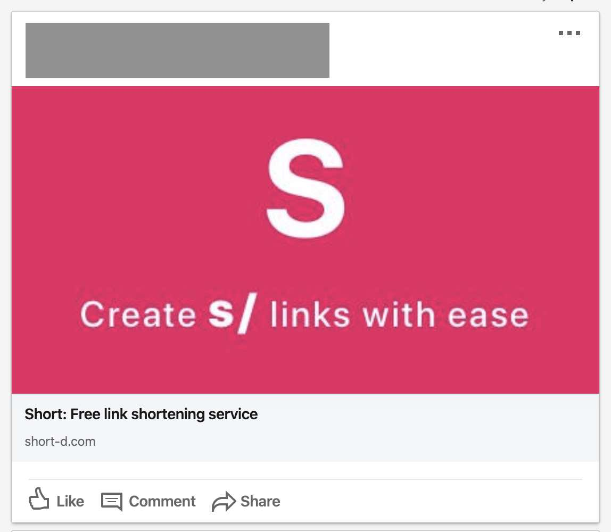
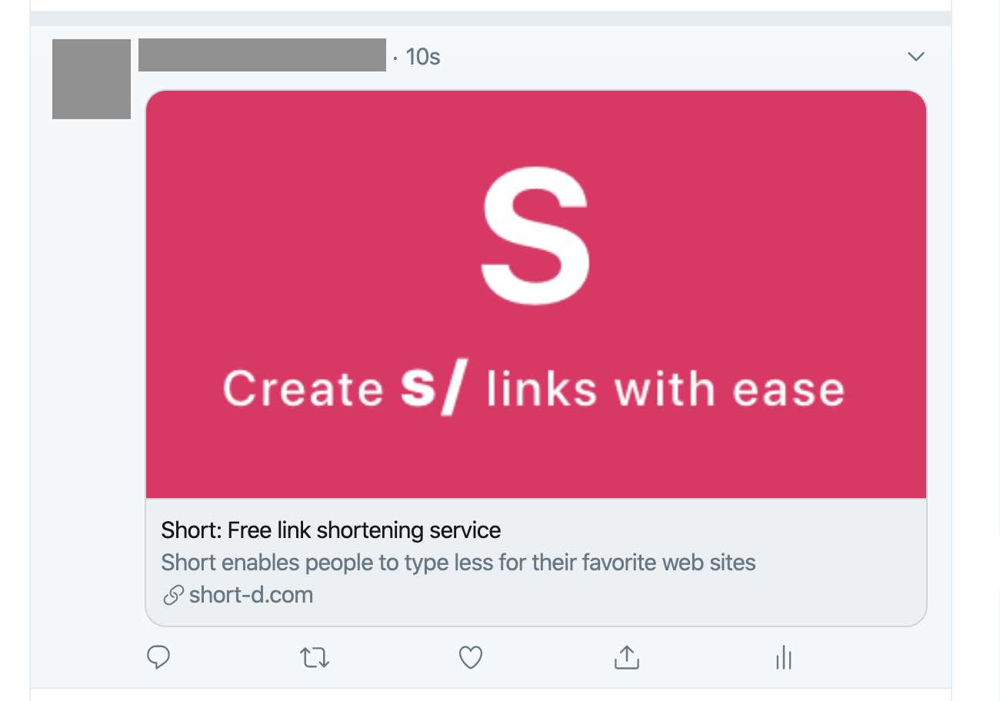
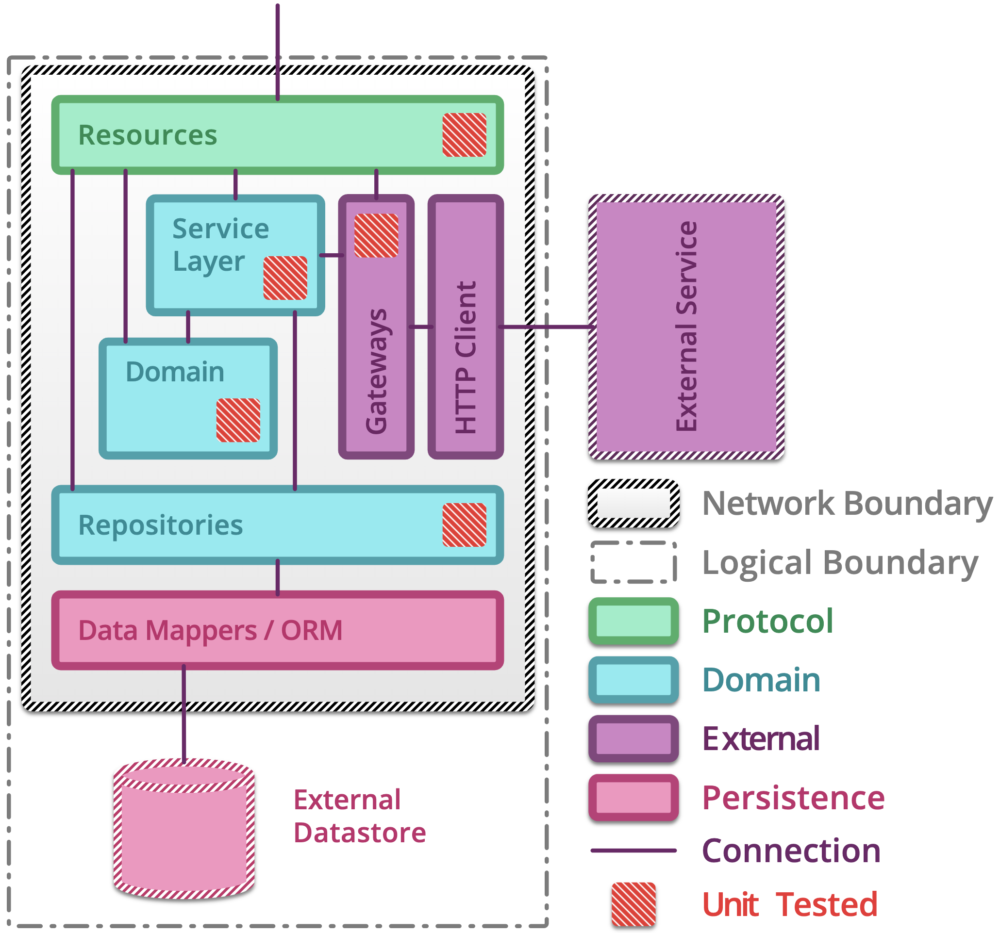
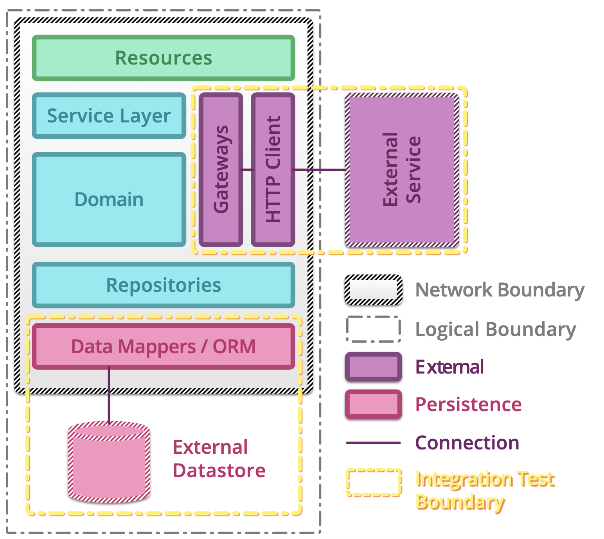
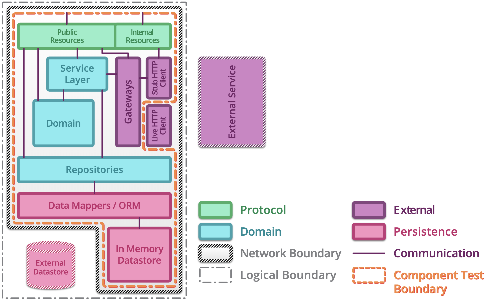
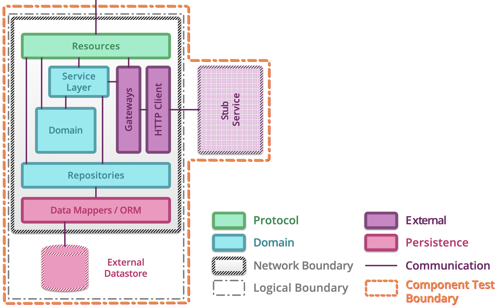

# Short

[](https://ci.time4hacks.com/byliuyang/short)
[](https://codecov.io/gh/byliuyang/short)
[](https://codeclimate.com/github/byliuyang/short/maintainability)
[](https://goreportcard.com/report/github.com/byliuyang/short)
[](https://github.com/byliuyang/short)
[](https://floobits.com/byliuyang/short/redirect)


## Preview


## Get `s/` Chrome extension

Install it from [Chrome Web Store](https://short-d.com/r/ext) or build it
from [source](https://short-d.com/r/ext-code)

## Table of Contents

1. [Getting Started](#getting-started)
   1. [Accessing the source code](#accessing-the-source-code)
   1. [Prerequisites](#prerequisites)
   1. [Create reCAPTCHA account](#create-recaptcha-account)
   1. [Create Github OAuth application](#create-github-oauth-application)
   1. [Create Facebook Application](#create-facebook-application)
   1. [Backend](#backend)
   1. [Frontend](#frontend)
1. [System Design](#system-design)
   1. [App Level Architecture](#app-level-architecture)
   1. [Service Level Archtecture](#service-level-archtecture)
   1. [Object Oriented Design](#object-oriented-design)
   1. [Dependency Injection](#dependency-injection)
   1. [Database Modeling](#database-modeling)
   1. [Feature Toggle](#feature-toggle)
   1. [Search Engine Optimization](#search-engine-optimization)
   1. [Social Media Summary Card](#social-media-summary-card)
1. [Testing](#testing)
   1. [The Importance Of Automation](#the-importance-of-automation)
   1. [Testing Strategy](#testing-strategy)
   1. [Unit Testing](#unit-testing)
   1. [Integration Testing](#integration-testing)
   1. [Component Testing](#component-testing)
   1. [Contract Testing](#contract-testing)
   1. [End To End Testing](#end-to-end-testing)
   1. [The Test Pyramid](#the-test-pyramid)
1. [Deployment](#deployment)
   1. [Kubernetes](#kubernetes)
   1. [Staging](#staging)
   1. [Production](#production)
1. [Tools We Use](#tools-we-use)
1. [Contributing](#contributing)
1. [Code Review Guideline](#code-review-guideline)
   1. [What to look for in a code review](#what-to-look-for-in-a-code-review)
   1. [The Standard](#the-standard)
   1. [Mentoring](#mentoring)
   1. [Principles](#principles)
   1. [Showing Apprecaition](#showing-apprecaition)
   1. [Resolving Conflicts](#resolving-conflicts)
1. [Author](#author)
1. [License](#license)

## Getting Started

### Accessing the source code

```bash
git clone https://github.com/byliuyang/short.git
```

### Prerequisites

- Go v1.13.1
- Node.js v12.12.0
- Yarn v1.19.1
- Postgresql v12.0 ( or use [ElephantSQL](https://short-d.com/r/sql) instead )

### Create reCAPTCHA account

1. Sign up at [ReCAPTCHA](https://short-d.com/r/recaptcha) with the
   following configurations:

   | Field           | Value          |
   |-----------------|----------------|
   | Label           | `Short`        |
   | reCAPTCHA type  | `reCAPTCHAv3`  |
   | Domains         | `localhost`    |

   

1. Open `settings`. Copy `SITE KEY` and `SECRET KEY`.

   

   

1. Replace the value of `RECAPTCHA_SECRET` in the `backend/.env` file with
   `SECRET KEY`.
1. Replace the value of `REACT_APP_RECAPTCHA_SITE_KEY` in
   `frontend/.env.development` file with `SITE KEY`.

### Create Github OAuth application

1. Create a new OAuth app at
   [Github Developers](https://short-d.com/r/ghdev) with the
   following configurations:

   | Field                      | Value                                            |
   |----------------------------|--------------------------------------------------|
   | Application Name           | `Short`                                          |
   | Homepage URL               | `http://localhost`                               |
   | Application description    | `URL shortening service written in Go and React` |
   | Authorization callback URL | `http://localhost/oauth/github/sign-in/callback` |

   

   

1. Copy `Client ID` and `Client Secret`.

   

1. Replace the value of `GITHUB_CLIENT_ID` in the `backend/.env` file with
   `Client ID`.
1. Replace the value of `GITHUB_CLIENT_SECRET` in the `backend/.env` file with
   `Client Secret`.

### Create Facebook Application

1. Create a new app at
   [Facebook Developers](https://short-d.com/r/fbdev) with the following configurations:

   | Field         | Value        |
   |---------------|--------------|
   | Display Name  | `Short Test` |
   | Contact Email | your_email   |

1. Add `Facebook Login` to the app.

   

1. Copy `App ID` and `App Secret` on `Settings` > `Basic` tab.

   

1. Replace the value of `FACEBOOK_CLIENT_ID` in `backend/.env` file with `App ID`.
1. Replace the value of `FACEBOOK_CLIENT_SECRET` in `backend/.env` file with
   `App Secret`.

### Backend

1. Copy `backend/.env.dist` file to `backend/.env`:

   ```bash
   cp backend/.env.dist backend/.env
   ```

1. Update `DB_HOST`, `DB_PORT`, `DB_USER`, `DB_PASSWORD`, `DB_NAME`,
   `RECAPTCHA_SECRET`, `GITHUB_CLIENT_ID`, `GITHUB_CLIENT_SECRET`, `FACEBOOK_CLIENT_ID`,
   `FACEBOOK_CLIENT_SECRET`, `FACEBOOK_REDIRECT_URI`, `JWT_SECRET`,
    with your own configurations.

1. Launch backend server

   ```bash
   cd backend
   ./scripts/dev
   ```

1. Remember to install developers tools before start coding:

   ```bash
   ./scripts/tools
   ```

### Frontend

Remember to update `REACT_APP_RECAPTCHA_SITE_KEY` in `frontend/.env.development`.

1. Launch frontend server

   ```bash
   cd frontend
   ./scripts/dev
   ```

1. Visit [http://localhost:3000](http://localhost:3000)

## System Design

### App Level Architecture

Short backend is built on top of
[Uncle Bob's Clean Architecture](https://api.short-d.com/r/ca), the central
objective of which is separation of concerns.


It enables the developers to modify a single component of the system at a time
while leaving the rest unchanged. This minizes the amount of changes have to
be made in order to support new requirements as the system grows. Clean
Architecture also improves the testability of system, which in turn saves
precious time when creating automated tests.

Here is an exmample of finance app using clean architecture:


### Service Level Archtecture

Short adopts [Microservices Architecture](https://api.short-d.com/r/ms) to
organize dependent services around business capabilities and to enable
independent deployment of each service.


### Object Oriented Design

Short leverages class design, package cohesion, and package coupling princiapls
to manage logical dependency between internal components.

#### Class Design

| Principal                                                        | Description                                                            |
|------------------------------------------------------------------|------------------------------------------------------------------------|
| [Single Responsibility Principle](https://api.short-d.com/r/srp) | A class should have one, and only one, reason to change.               |
| [Open Closed Principle](https://api.short-d.com/r/ocp)           | You should be able to extend a classes behavior, without modifying it. |
| [Liskov Substitution Principle](https://api.short-d.com/r/lsp)   | Derived classes must be substitutable for their base classes.          |
| [Interface Segregation Principle](https://api.short-d.com/r/isp) | Make fine grained interfaces that are client specific.                 |
| [Dependency Inversion Principle](https://api.short-d.com/r/dip)  | Depend on abstractions, not on concretions.                            |

#### Package Cohesion

| Principal                                                            | Description                                           |
|----------------------------------------------------------------------|-------------------------------------------------------|
| [Release Reuse Equivalency Principle](https://api.short-d.com/r/rep) | The granule of reuse is the granule of release.       |
| [The Common Closure Principle](https://api.short-d.com/r/ccp)        | Classes that change together are packaged together.   |
| [The Common Reuse Principle](https://api.short-d.com/r/crp)          | Classes that are used together are packaged together. |

#### Package Coupling

| Principal                                                       | Description                                           |
|-----------------------------------------------------------------|-------------------------------------------------------|
| [Acyclic Dependencies Principle](https://api.short-d.com/r/adp) | The dependency graph of packages must have no cycles. |
| [Stable Dependencies Principle](https://api.short-d.com/r/sdp)  | Depend in the direction of stability.                 |
| [Stable Abstractions Principle](https://api.short-d.com/r/sap)  | Abstractness increases with stability.                |

### Dependency Injection

Short produces flexible and loosely coupled code, by explicitly providing
components with all of the dependencies they need.

```go
type Authenticator struct {
  tokenizer          fw.CryptoTokenizer
  timer              fw.Timer
  tokenValidDuration time.Duration
}

func NewAuthenticator(
  tokenizer fw.CryptoTokenizer,
  timer fw.Timer,
  tokenValidDuration time.Duration,
) Authenticator {
  return Authenticator{
    tokenizer:          tokenizer,
    timer:              timer,
    tokenValidDuration: tokenValidDuration,
  }
}
```

Short also simplifies the management of the big block of order-dependent
initialization code with [Wire](https://api.short-d.com/r/wire), a compile time
depedency injection framework by Google.

```go
func InjectGraphQlService(
  name string,
  sqlDB *sql.DB,
  graphqlPath provider.GraphQlPath,
  secret provider.ReCaptchaSecret,
  jwtSecret provider.JwtSecret,
  bufferSize provider.KeyGenBufferSize,
  kgsRPCConfig provider.KgsRPCConfig,
) (mdservice.Service, error) {
  wire.Build(
    wire.Bind(new(fw.GraphQlAPI), new(graphql.Short)),
    wire.Bind(new(url.Retriever), new(url.RetrieverPersist)),
    wire.Bind(new(url.Creator), new(url.CreatorPersist)),
    wire.Bind(new(repo.UserURLRelation), new(db.UserURLRelationSQL)),
    wire.Bind(new(repo.URL), new(*db.URLSql)),
    wire.Bind(new(keygen.KeyGenerator), new(keygen.Remote)),
    wire.Bind(new(service.KeyFetcher), new(kgs.RPC)),

    observabilitySet,
    authSet,

    mdservice.New,
    provider.NewGraphGophers,
    mdhttp.NewClient,
    mdrequest.NewHTTP,
    mdtimer.NewTimer,

    db.NewURLSql,
    db.NewUserURLRelationSQL,
    provider.NewRemote,
    url.NewRetrieverPersist,
    url.NewCreatorPersist,
    provider.NewKgsRPC,
    provider.NewReCaptchaService,
    requester.NewVerifier,
    graphql.NewShort,
  )
  return mdservice.Service{}, nil
}
```

### Database Modeling


### Feature Toggle

Short employs `feature toggles` to modify system behavior without changing code.
UI components controlled by the feature toggles are created inside a centralized
`UIFactory` in order to avoid having nested `if` `else` statement across the
code base:

```typescript
// UIFactory.tsx
export class UIFactory {
  constructor(
    private featureDecisionService: IFeatureDecisionService
  ) {}

  public createGoogleSignInButton(): ReactElement {
    if (!this.featureDecisionService.includeGoogleSignButton()) {
      return <div />;
    }
    return (
      <GoogleSignInButton
        googleSignInLink={this.authService.googleSignInLink()}
      />
    );
  }

  public createGithubSignInButton(): ReactElement {
    if (!this.featureDecisionService.includeGithubSignButton()) {
      return <div />;
    }
    return (
      <GithubSignInButton
        githubSignInLink={this.authService.githubSignInLink()}
      />
    );
  }
}
```

Short also provides `IFeatureDecisionService` interface, allowing the developers
to switch to dynamic feature toggle backend in the future by simply swapping
the dependency injected.

```typescript
// FeatureDecision.service.ts
export interface IFeatureDecisionService {
  includeGithubSignButton(): boolean;
  includeGoogleSignButton(): boolean;
  includeFacebookSignButton(): boolean;
}
```

```typescript
// StaticConfigDecision.service.ts
import { IFeatureDecisionService } from './FeatureDecision.service';

export class StaticConfigDecisionService implements IFeatureDecisionService {
  includeGithubSignButton(): boolean {
    return false;
  }
  includeGoogleSignButton(): boolean {
    return false;
  }
  includeFacebookSignButton(): boolean {
    return true;
  }
}
```

```typescript
// dep.ts
export function initUIFactory(
  ...
): UIFactory {
  ...
  const staticConfigDecision = new StaticConfigDecisionService();
  ...
  return new UIFactory(
    ...,
    staticConfigDecision
  );
}
```

You can read about the detailed feature toggle design on
[this article](https://martinfowler.com/articles/feature-toggles.html).

### Search Engine Optimization

In order to improve the quality and quantity of the website's traffic, Short
increases its visibility to web search engines through HTML meta tags.

```html
<!-- ./frontend/public/index.html -->
<title>Short: Free online link shortening service</title>

<!-- Search Engine Optimization -->
<meta name="description"
      content="Short enables people to type less for their favorite web sites">
<meta name="robots" content="index, follow">
<link href="https://short-d.com" rel="canonical">
```

If you search `short-d.com` on Google, you should see Short shows up as
the first result:


### Social Media Summary Card

#### Facebook & LinkedIn

Short leverages `Open Graph` tags to control what content shows up in
the summary card when the website is shared on Facebook or LinkedIn:

```html
<!-- ./frontend/public/index.html -->
<!-- Open Graph -->
<meta property="og:title" content="Short: Free link shortening service"/>
<meta property="og:description"
      content="Short enables people to type less for their favorite web sites"/>
<meta property="og:image"
      content="https://short-d.com/promo/small-tile.png"/>
<meta property="og:url" content="https://short-d.com"/>
<meta property="og:type" content="website"/>
```

Shared on Facebook:


Shared on LinkedIn:



#### Twitter

Twitter uses its own meta tags to determine what will show up when
the website is mentioned in a Tweet:

```html
<!-- Twitter -->
<meta name="twitter:card" content="summary_large_image"/>
<meta name="twitter:site" content="@byliuyang11"/>
<meta name="twitter:title" content="Short: Free link shortening service"/>
<meta name="twitter:description"
      content="Short enables people to type less for their favorite web sites"/>
<meta name="twitter:image" content="https://short-d.com/promo/twitter-card.png"/>
```



## Testing

### The Importance Of Automation

Short is maintained by a small team of talented software engineers working
at Google, Uber, and Vmware as a side project. The team wants to deliver new
features faster without sacrificing its quality. Testing ever-increasing
amount of features manually soon becomes impossible — unless we want
to spend all our time with manual, repetitive work instead of delivering
working features.

Test automation is the only way forward.

### Testing Strategy


Please read [Testing Strategies in a Microservice Architecture](https://martinfowler.com/articles/microservice-testing)
for a detailed introduction on test strategies.

### Unit Testing

A unit test exercises the smallest piece of testable software in the
application to determine whether it behaves as expected.



#### Sociable And Solitary


#### The FIRST Principal

- [F]ast: Unit tests should be fast otherwise they will slow down
   development & deployment.
- [I]ndependent: Never ever write tests which depend on other test cases.
- [R]epeatable: A repeatable test is one that produces the same results
   each time you run it.
- [S]elf-validating: There must be no manual interpretation of the results.
- [T]imely/[T]horoughly: Unit tests must be included for every pull request
   of a new feature and cover edge cases, errors, and bad inputs.

#### Test Structure

A automated test method should be composed of 3As: Arrange, Act, and Assert.

- [A]rrange: All the data needed for a test should be arranged as part
  of the test. The data used in a test should not depend on the environment
  in which the test is running.
- [A]ct: Invoke the actual method under test.
- [A]ssert: A test method should test for a single logical outcome.

### Integration Testing

An integration test verifies the communication paths and interactions
between components to detect interface defects.



### Component Testing

A component test limits the scope of the exercised software to a portion
of the system under test, manipulating the system through internal code
interfaces and using test doubles to isolate the code under test from
other components.

#### In Process



#### Out Of Process



### Contract Testing

An integration contract test is a test at the boundary of an external
service verifying that it meets the contract expected by a consuming
service.

### End To End Testing

An end-to-end test verifies that a system meets external requirements
and achieves its goals, testing the entire system, from end to end.

### The Test Pyramid


## Deployment

### Kubernetes

Short leverages [Kubernetes](https://kubernetes.io) to automate deployment, scaling,
and management of containerized microservices.


Short uses [GitOps](https://github.com/byliuyang/gitops) to manage Kubernetes cluster.


### Staging

Merging pull request into master branch on Github will automatically deploy the
changes to [staging](https://staging.short-d.com) environment.

### Production

Merging from `master` branch to `production` branch will automatically
deploy the latest code to the production. This is called continuous
delivery in the DevOps world.


In the future, when there are enough automated tests, we may migrate to
continuous deployment instead.


## Tools We Use

- [Drone](https://short-d.com/r/ci): Continuous integration
  written in Go
- [Code Climate](https://short-d.com/r/cs): Automated code
  review
- [ElephantSQL](https://www.elephantsql.com): Managed PostgreSQL service.

## Contributing

Please read [CONTRIBUTING.md](CONTRIBUTING.md) for details on our code
of conduct, and the process for submitting pull requests to us.

## Code Review Guideline

### What to look for in a code review

- The code is well-designed.
- The functionality is good for the users of the code.
- Any UI changes are sensible and look good.
- Any parallel programming is done safely.
- The code isn’t more complex than it needs to be.
- The developer isn’t implementing things they might need in the future but don’t
  know they need now.
- Code has appropriate unit tests.
- Tests are well-designed.
- The developer used clear names for everything.
- Comments are clear and useful, and mostly explain why instead of what.
- Code is appropriately documented.

### The Standard

- Reviewers should favor approving a PR once it is in a state where it definitely
  improves the overall code health of the system being worked on, even if the PR
  isn’t perfect.
- Instead of seeking perfection, what a reviewer should seek is continuous
  improvement.
- If a PR adds a feature that the reviewer doesn’t want in their system, then the
  reviewer can certainly deny approval even if the code is well-designed.
- Reviewers should always feel free to leave comments expressing that something
  could be better, but if it’s not very important, prefix it with something like
  “Nit: “ to let the author know that it’s just a point of polish that they could
  choose to ignore.
- Checking in PRs that definitely worsen the overall code health of the system is
  not justified unless there is an emergency.

### Mentoring

Code review can have an important function of teaching developers something new
about a language, a framework, or general software design principles.

If the comment is purely educational, but not critical to meeting the standards
above, prefix it with "Nit: ".

### Principles

- Technical facts and data overrule opinions and personal preferences.
- On matters of style, the linters are the absolute authorities. The style should
  be consistent with what is there. If there is no previous style, accept the
  author’s.
- Aspects of software design are NOT personal preferences. Sometimes there are a
  few valid options. If the author can demonstrate that several approaches are
  equally valid, then the reviewer should accept the preference of the author.
  Otherwise the choice is dictated by standard principles of software design.
- If no other rule applies, then the reviewer may ask the author to be consistent
  with what is in the current codebase, as long as that doesn’t worsen the overall
  code health of the system.

### Showing Apprecaition

If you see something nice in the PR, tell the developer, especially when they
addressed one of your comments in a great way. Code reviews should offer
encouragement and appreciation for good practices, as well. It’s sometimes even
more valuable, in terms of mentoring, to tell a developer what they did right
than to tell them what they did wrong.

### Resolving Conflicts

When coming to consensus becomes especially difficult, it can help to have a
face-to-face meeting or a video call between the reviewer and the author, instead
of just trying to resolve the conflict through code review comments. (If you do
this, though, make sure to record the results of the discussion in a comment on
the CL, for future readers.)

Don’t let a PR sit around because the author and the reviewer can’t come to an
agreement.

Note: This guideline is derived from [Google Engineering Practices Documentation](https://github.com/google/eng-practices)

## Author

Harry Liu - *Initial work* - [byliuyang](https://short-d.com/r/ghharry)

As the tech lead of Short, I am responsible for the overall planning, execution
and success of complex software solutions to meet users' needs.

I deeply believe in and am striving to achieve on the right column of this
following diagram:


## License

This project is maintained under MIT license
